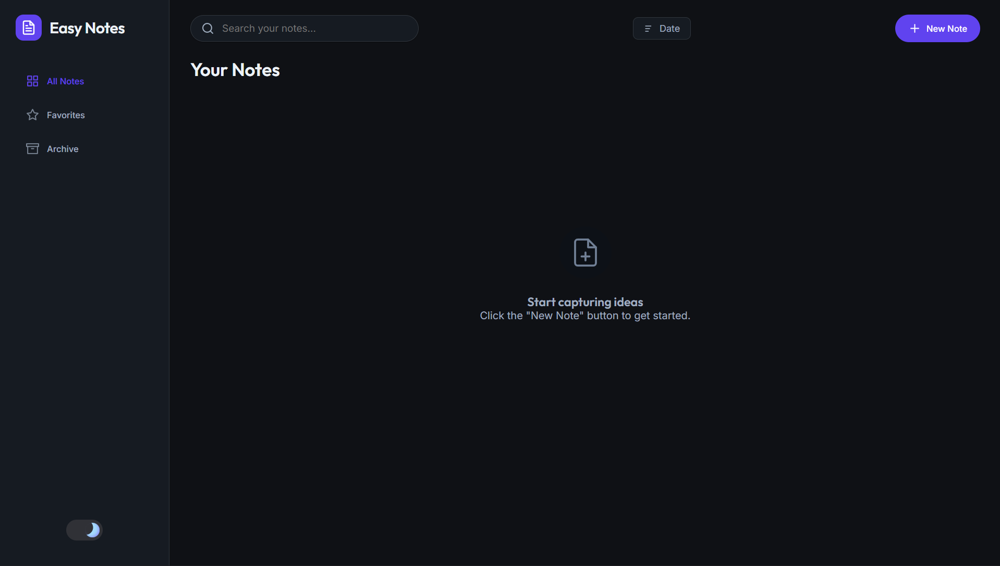
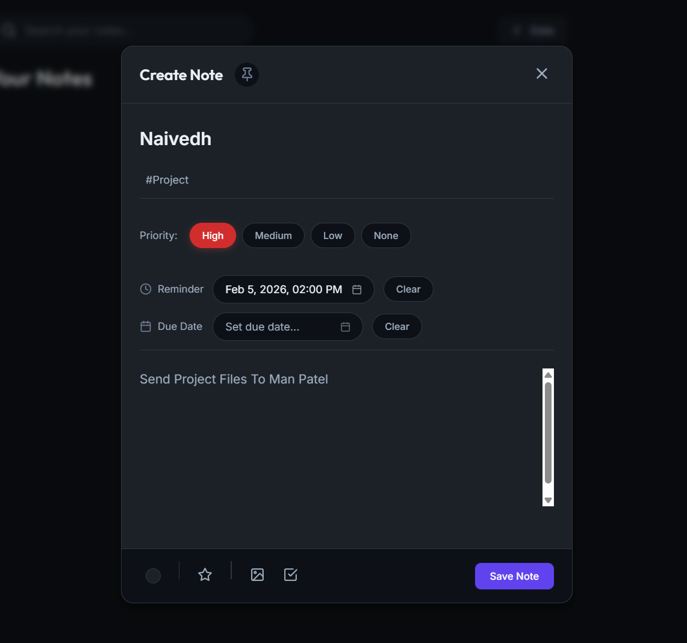
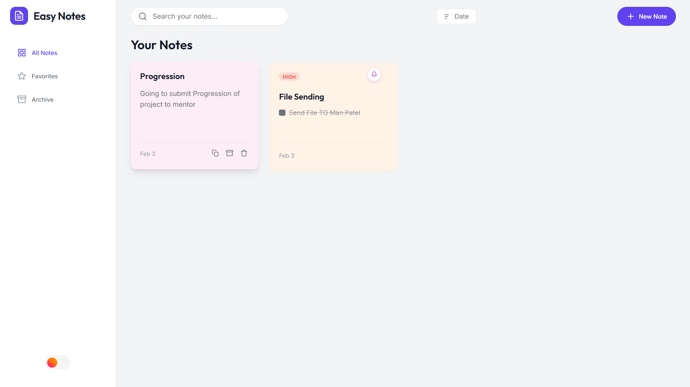

# 📝 Easy Notes

A modern, feature-rich notes application with a beautiful UI, dark/light theme toggle, and powerful organization features.


## 🌐 Live Demo

🔗 **[View Live Demo](https://naivedhP2518.github.io/Keep-Notes-/)**

---

## 📸 Screenshots

|       Main Page (Dark Mode)       |          Add/Edit Notes           |
| :-------------------------------: | :-------------------------------: |
|  |  |

|             Light Mode              |         Custom Calendar          |
| :---------------------------------: | :------------------------------: |
|  |  |

---

## ✨ Features

### 📓 Core Features

- **Create & Edit Notes** - Rich text notes with title, content, and tags
- **Image Attachments** - Add images to your notes
- **Checklist Mode** - Toggle between text and checklist view
- **Color Coding** - Personalize notes with custom colors
- **Pin Notes** - Keep important notes at the top

### 🎯 Organization

- **Priority Levels** - Set High, Medium, Low, or None priority
- **Due Dates** - Track deadlines with visual indicators
- **Reminders** - Get browser notifications for important notes
- **Tags** - Organize with custom hashtags
- **Archive** - Move old notes to archive

### 🔍 Navigation

- **Search** - Find notes instantly
- **Sort Options** - By date, priority, alphabetical, or due date
- **Filter Views** - All notes, Favorites, or Archive
- **Duplicate Notes** - Quick copy existing notes

### 🎨 Design

- **Dark/Light Mode** - Beautiful sun/moon animated toggle
- **Responsive Design** - Works on desktop, tablet, and mobile
- **Modern UI** - Glassmorphism, rounded corners, smooth animations
- **3D Flip Checkboxes** - Cool animated checkboxes
- **Custom Date Picker** - Modern rounded calendar UI

---

## 🚀 Quick Start

### Option 1: Direct Use

1. Clone or download this repository
2. Open `index.html` in your browser
3. Start creating notes!

### Option 2: Local Server

```bash
# Clone the repository
git clone https://github.com/naive/notes-app.git

# Navigate to project folder
cd notes-app

# Open with live server (VS Code extension) or
# Use Python simple server
python -m http.server 8000

# Visit http://localhost:8000
```

---

## 📁 Project Structure

```
notes-app/
├── index.html          # Main HTML file
├── css/
│   ├── variables.css   # CSS custom properties & theme colors
│   └── style.css       # Main stylesheet
├── js/
│   ├── storage.js      # LocalStorage data layer
│   ├── ui.js           # UI rendering & DOM manipulation
│   ├── datepicker.js   # Custom date picker component
│   └── app.js          # Main application controller
├── Images/             # Screenshot images
└── README.md           # You are here!
```

---

## 🛠️ Technologies Used

| Technology        | Purpose                     |
| ----------------- | --------------------------- |
| **HTML5**         | Semantic structure          |
| **CSS3**          | Styling, animations, themes |
| **JavaScript**    | Logic & interactivity       |
| **LocalStorage**  | Data persistence            |
| **Google Fonts**  | Inter & Outfit fonts        |
| **CSS Variables** | Dynamic theming             |

---

## 🎨 Customization

### Changing Theme Colors

Edit `css/variables.css` to customize the color scheme:

```css
:root {
  --color-primary: hsl(259, 80%, 60%);
  --primary-h: 259;
  --primary-s: 80%;
  --primary-l: 60%;
}
```

### Adding New Priority Levels

1. Add new color variables in `variables.css`
2. Update priority button HTML in `index.html`
3. Add CSS styles in `style.css`
4. Update UI logic in `ui.js`

---

## 🤝 Contributing

Contributions are welcome! Here's how:

1. Fork the repository
2. Create a feature branch (`git checkout -b feature/AmazingFeature`)
3. Commit changes (`git commit -m 'Add AmazingFeature'`)
4. Push to branch (`git push origin feature/AmazingFeature`)
5. Open a Pull Request

---

## 📄 License

This project is open source and available under the [MIT License](LICENSE).

---

## 👨‍💻 Author

**Naivedh**

- GitHub: [@naive](https://github.com/naive)

---

## 🙏 Acknowledgments

- [Uiverse.io](https://uiverse.io) - UI components inspiration
- [Google Fonts](https://fonts.google.com) - Typography
- [Feather Icons](https://feathericons.com) - SVG icons

---

<p align="center">
  Made with ❤️ and JavaScript
</p>
